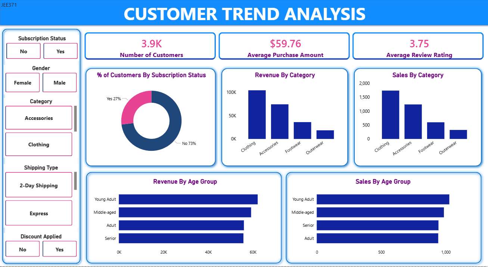

# 📊 Customer Trend Analysis

This project focuses on analyzing **customer purchasing trends and behavior** by transforming raw data into actionable business intelligence. The workflow follows a professional data analytics pipeline, moving from programmatic exploration to relational database querying and final executive visualization.

The objective is to identify high-value customer segments, product performance, and other various trends to support data-driven decision-making.

---

## 🛠 Tools & Technologies Used
* **Python:** Data cleaning and Exploratory Data Analysis (Pandas, Matplotlib, Seaborn).
* **Google Colab:** Cloud-based environment for reproducible data science scripts.
* **SQL Server (SSMS):** Relational database management for complex analytical queries.
* **Power BI:** Interactive dashboarding and KPI tracking.
* **Dataset:** CSV format containing demographics, transaction history, and ratings.

---

## 🔎 Project Workflow

### 1️⃣ Data Exploration & Cleaning (Python)
The initial phase involved a deep dive into the dataset using **Python** to ensure data integrity:
* **Preprocessing:** Handled missing values, duplicates, and standardized data types.
* **EDA:** Analyzed key factors and removed unwanted features to streamline the dataset.
* **Feature Engineering:** Created new features crucial for deeper analytical insights.

### 2️⃣ Analytical Queries (SQL)
The cleaned dataset was imported into **SQL Server Management Studio** to perform deep-dive querying and uncover hidden business patterns:

* **Revenue & Performance Trends:** Analyzed total revenue by gender and age group to identify which demographics drive the highest financial contribution.
* **Customer Behavior & Subscriptions:** Investigated how subscription status and repeat purchase history (Previous Purchases > 5) correlate with overall spending and customer loyalty.
* **Product & Promotional Insights:** Identified top-rated items, high-performing products within each category, and the impact of discounts on customer purchasing decisions.

### 3️⃣ Interactive Visualization (Power BI)
A dynamic dashboard was developed to translate complex numbers into visual stories. Key features include:
* **KPI Monitoring:** Real-time tracking of Total Customers, Average Purchase Amount, and Average Ratings.
* **Demographic Segmentation:** Visual breakdowns of revenue and sales volume across age groups.
* **Behavioral Analysis:** Comparative views of subscription rates and category-wise performance.
* **Dynamic Slicers:** Interactive filters for Gender, Subscription Status, Shipping Type, and Discount Application.

---

## 📊 Dashboard Preview


---

## 📂 Repository Structure
```text
customer-trend-analysis
│
├── dashboard/
│   ├── customer_analysis_dashboard.png   # Visual Preview
│   └── customer_trend_dashboard.pbix     # Power BI Source File
│
├── data/
│   ├── customer_data.csv                 # Raw Input
│   └── customer_shopping_behavior.csv    # Processed Dataset
│
├── customer_trends.sql                # SQL Analytical Queries
├── customer_trends_analysis.ipynb     # Python EDA Notebook
└── LICENSE                            # MIT License
